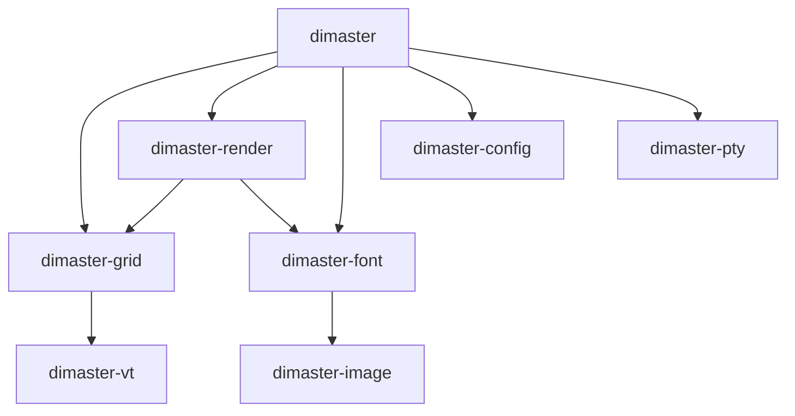
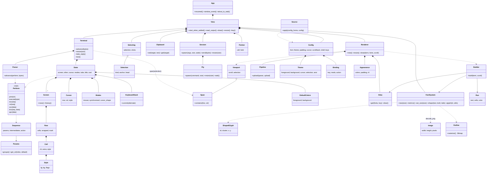
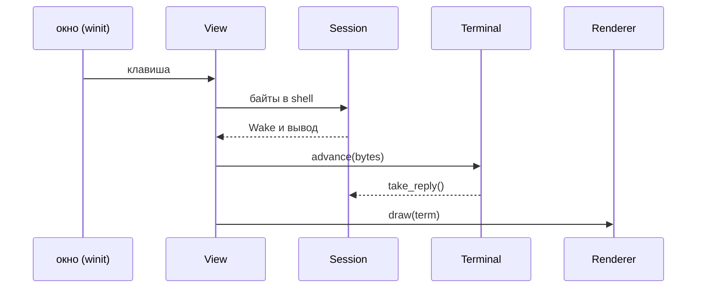

# DimaSter: диаграммы

## Зависимости крейтов

```mermaid
graph TD
    app[dimaster] --> grid[dimaster-grid]
    app --> render[dimaster-render]
    app --> font[dimaster-font]
    render --> grid
    render --> font
    font --> image[dimaster-image]
    app --> config[dimaster-config]
    app --> pty[dimaster-pty]
    grid --> vt[dimaster-vt]
```

## Классы

```mermaid
classDiagram
    class Parser { +advance(perform, bytes) }
    class Perform {
        <<trait>>
        print(ch)
        execute(byte)
        esc(seq)
        csi(seq)
        osc(data)
        dcs(seq, data)
        apc(data)
    }
    class Sequence { params; intermediates; action }
    class Params { +groups() +get_or(index, default) }
    class Terminal {
        +advance(bytes)
        +resize(size)
        +take_reply()
        +text()
    }
    class State { screen; other; cursor; modes; tabs; title; cwd }
    class Screen { +rows() +history() }
    class Row { cells; wrapped; mark }
    class Cell { ch; extra; style }
    class Style { fg; bg; flags }
    class Cursor { row; col; style }
    class Modes { mouse; synchronized; cursor_shape }
    class KeyboardStack { +current(alternate) }
    class Selection { kind; anchor; head }
    class Span { +contains(line, col) }
    class Selecting { selection; clicks }
    class Clipboard { +set(target, text) +get(target) }
    class Viewport { scroll; selection }
    View *-- Selecting
    View *-- Clipboard
    Selecting o-- Selection
    Terminal ..> Span : span(selection)
    Renderer ..> Viewport
    Viewport o-- Span
    class DefaultColors { foreground; background }
    class Pointer { cell; held }
    State *-- KeyboardStack
    State *-- DefaultColors
    View *-- Pointer
    class Pty { +spawn(command, size) +resize(size) +wait() }
    class App { +resumed() +window_event() +about_to_wait() }
    class View { +start_when_settled() +read_output() +draw() +resize() +key() }
    class Session { +spawn(args, size, wake) +send(bytes) +resize(size) }
    class Renderer { +new() +resize() +draw(term, fonts, scroll) }
    class Builder { +build(term, scroll) }
    class Atlas { +get(fonts, key) +clear() }
    class Pipeline { +upload(queue, upload) }
    class FontSystem { +new(size) +metrics() +set_size(size) +shape(text, bold, italic) +glyph(id, cells) }
    class ShapedGlyph { id; cluster; x; y }
    class Run { text; cells; color }
    class Image { width; height; pixels }
    class Config { font; theme; padding; cursor; scrollback; shell; keys }
    class Theme { foreground; background; cursor; selection; ansi }
    class Binding { key; mods; action }
    class Source { +apply(config_home, config) }
    class Appearance { colors; padding; rtl }
    Config *-- Theme
    Config *-- Binding
    Source ..> Config
    View *-- Config
    Renderer *-- Appearance
    FontSystem ..> ShapedGlyph
    FontSystem ..> Image : decode_png
    Builder --> Run
    class Outline { +rasterize() Bitmap }

    App *-- View
    View *-- Terminal
    View *-- Session
    View *-- Renderer
    View *-- FontSystem
    Session *-- Pty
    Renderer *-- Atlas
    Renderer *-- Pipeline
    Renderer ..> Builder
    Builder --> Atlas
    Builder --> FontSystem
    FontSystem ..> Outline

    Terminal *-- Parser
    Terminal *-- State
    Parser ..> Perform
    Perform ..> Sequence
    Sequence --> Params
    State ..|> Perform
    State *-- "2" Screen
    State *-- Cursor
    State *-- Modes
    Screen *-- Row
    Row *-- Cell
    Cell *-- Style
```

## Поток данных

```mermaid
sequenceDiagram
    participant W as окно (winit)
    participant V as View
    participant S as Session
    participant T as Terminal
    participant R as Renderer
    W->>V: клавиша
    V->>S: байты в shell
    S-->>V: Wake и вывод
    V->>T: advance(bytes)
    T-->>S: take_reply()
    V->>R: draw(term)
```
